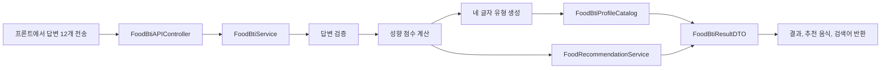

# 음BTI 백엔드 기능 설명

이 문서는 음BTI 백엔드의 전체 흐름, 클래스별 역할, 계산 방식,
테스트 방법과 발표용 설명을 다시 확인하기 위한 문서입니다.

## 1. 전체 기능

음BTI 백엔드는 다음 작업을 순서대로 수행합니다.

```text
12개 답변 수신
    -> 답변 검증
    -> 네 가지 성향 점수 계산
    -> 네 글자 음BTI 유형 생성
    -> 16개 결과 중 이름과 설명 조회
    -> 음식별 성향 일치도 계산
    -> 추천 음식 5개와 검색 키워드 반환
```



## 2. 성향 구분

질문은 성향별로 세 개씩 총 12개입니다.

| 질문 | 성향 | 의미 |
|---|---|---|
| 1~3번 | L / S | 담백한 맛 / 강한 맛 |
| 4~6번 | F / N | 익숙한 음식 / 새로운 음식 |
| 7~9번 | A / T | 혼자 먹기 / 함께 먹기 |
| 10~12번 | P / I | 계획적 선택 / 즉흥적 선택 |

각 축에는 질문이 세 개이므로 정상 답변에서는 동점이 발생하지 않습니다.

## 3. 클래스별 역할

### FoodBtiAPIController

경로:

```text
src/main/java/com/foodtrip/foodsearch/controller/FoodBtiAPIController.java
```

프론트의 HTTP 요청을 받는 입구입니다.

- `GET /api/food-bti/questions`: 질문 12개 반환
- `POST /api/food-bti/result`: 답변을 받아 계산 결과 반환

Controller는 직접 계산하지 않고 `FoodBtiService`에 계산을 요청합니다.

### FoodBtiService

경로:

```text
src/main/java/com/foodtrip/foodsearch/service/FoodBtiService.java
```

음BTI의 전체 계산 순서를 관리하는 핵심 서비스입니다.

1. 답변 12개가 모두 들어왔는지 확인
2. 질문 위치에 맞는 알파벳인지 확인
3. 각 알파벳의 선택 횟수 계산
4. 네 글자 결과 유형 생성
5. 결과 이름과 설명 조회
6. 성향 비율 생성
7. 음식 추천 서비스 호출

### FoodBtiProfileCatalog

경로:

```text
src/main/java/com/foodtrip/foodsearch/service/FoodBtiProfileCatalog.java
```

16개 음BTI 유형의 고유 이름과 설명을 관리합니다.

```java
add(profileMap, "SNTP", "매운맛 탐험가",
        "강렬한 맛과 새로운 음식을 좋아하며...");
```

유형 이름이나 설명을 바꾸고 싶을 때 이 파일을 수정하면 됩니다.

### FoodRecommendationService

경로:

```text
src/main/java/com/foodtrip/foodsearch/service/FoodRecommendationService.java
```

음식 32개의 성향 태그와 사용자 점수를 비교해 추천 순위를 계산합니다.

```java
food("마라탕", "마라탕", 'S', 'N', 'T', 'P')
food("칼국수", "칼국수", 'L', 'F', 'A', 'P')
```

모든 음식의 일치도를 계산한 뒤 높은 순서대로 5개를 반환합니다.

### DTO

DTO는 계산하지 않고 데이터를 전달하는 상자입니다.

- `FoodBtiAnswerDTO`: 프론트가 보낸 답변
- `ScoreDTO`: L, S, F, N, A, T, P, I 원점수
- `TraitScoreDTO`: 성향별 백분율
- `FoodRecommendationDTO`: 음식명, 검색어, 일치도, 추천 이유
- `FoodBtiResultDTO`: 최종 응답 전체

## 4. 답변 검증

기존 프론트 요청 형식은 유지합니다.

```json
{
  "answer": [
    "S", "S", "L",
    "N", "N", "F",
    "T", "T", "A",
    "P", "P", "I"
  ]
}
```

서버는 질문 위치에 따라 허용되는 알파벳을 검사합니다.

```text
1번 질문에 N 입력 -> 오류
4번 질문에 S 입력 -> 오류
답변이 11개 또는 13개 -> 오류
```

잘못된 요청은 `ApiExceptionHandler`가 HTTP 400 응답으로 변환합니다.

## 5. 유형 계산 예시

다음과 같이 답변했다고 가정합니다.

```text
S, S, L -> S 2점 / L 1점
N, N, F -> N 2점 / F 1점
T, T, A -> T 2점 / A 1점
P, P, I -> P 2점 / I 1점
```

각 축에서 점수가 높은 알파벳을 연결합니다.

```text
S + N + T + P = SNTP
```

성향 비율은 다음과 같이 계산됩니다.

```text
S = 2 / 3 * 100 = 67%
L = 1 / 3 * 100 = 33%
```

## 6. 음식 일치도 계산

사용자 점수가 다음과 같다고 가정합니다.

```text
S 2점, N 3점, T 2점, P 2점
```

마라탕의 태그는 `S, N, T, P`이므로 다음과 같이 계산합니다.

```text
2 + 3 + 2 + 2 = 9점
9 / 12 * 100 = 75점
```

일치도가 높은 음식부터 정렬해 상위 5개를 추천합니다.

## 7. 검색 기능 연결

추천 결과에는 검색 기능이 사용할 `searchKeyword`가 포함됩니다.

```json
{
  "name": "마라탕",
  "searchKeyword": "마라탕",
  "matchScore": 100,
  "reason": "재료와 맵기를 직접 조합하며 새로운 맛을 함께 즐기기 좋아요. 특히 새로운 메뉴에 도전하는 성향과 잘 맞아요."
}
```

지도나 맛집 검색 기능은 사용자가 추천 음식을 선택했을 때
`searchKeyword`를 받아 검색하면 됩니다.

음BTI 백엔드는 실제 지도 API를 호출하지 않고 검색 키워드를 만드는 데까지 담당합니다.

## 8. 테스트

서비스 계산 테스트:

```text
src/test/java/com/foodtrip/foodsearch/service/FoodBtiServiceTest.java
```

Controller JSON 테스트:

```text
src/test/java/com/foodtrip/foodsearch/controller/FoodBtiAPIControllerTest.java
```

`FoodBtiServiceTest`의 `answerForType("SNTP")`는 다음 답변을 자동으로 만듭니다.

```text
S, S, S, N, N, N, T, T, T, P, P, P
```

## 9. 추천 이유가 반복되는 이유

현재 추천 이유 생성 로직은 음식과 결과가 일치하는 성향을 다음 순서로 확인합니다.

```text
맛 강도 -> 새로움 -> 식사 방식 -> 선택 방식
```

그중 앞의 두 개만 문장에 사용하기 때문에 강한 맛 음식들은
`강한 맛 선호, 새 메뉴 도전`이라는 문장이 반복될 수 있습니다.

이 현상은 질문이 12개라서 발생하는 것이 아니라
추천 이유를 만드는 문장 규칙이 고정되어 있어서 발생합니다.

개선 방법은 다음과 같습니다.

1. 음식마다 고유한 추천 설명을 추가합니다.
2. 네 성향 중 해당 음식에서 가장 특징적인 성향을 선택합니다.
3. 식사 방식이나 선택 방식도 번갈아 추천 이유에 사용합니다.
4. 상황 질문을 별도로 받아 추천 이유에 반영합니다.

질문 수를 늘리는 것은 점수를 더 세밀하게 만들 때 필요하며,
추천 이유 문장의 반복을 해결하는 방법은 아닙니다.

## 10. 발표용 요약

> 사용자의 12개 답변을 네 가지 음식 성향으로 분류하고,
> 각 축의 다수 점수를 조합해 16개 음BTI 유형 중 하나를 결정합니다.
> 이후 음식별 성향 태그와 사용자의 원점수를 비교해 일치도를 계산하고,
> 상위 5개 음식과 실제 검색에 사용할 키워드를 반환하도록 구현했습니다.
